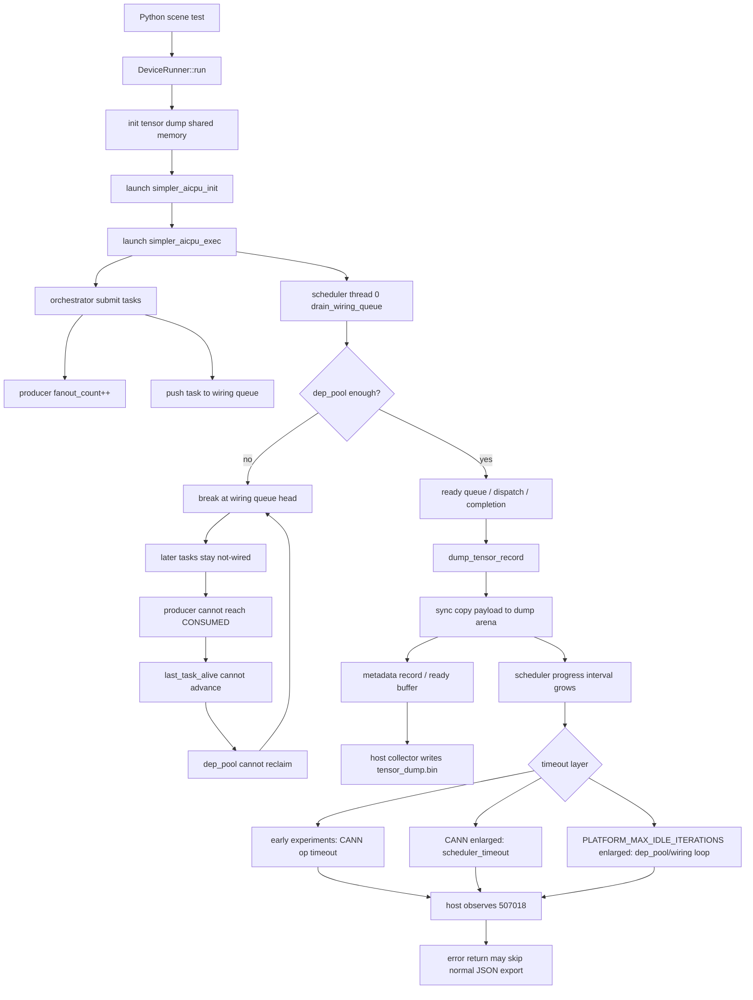

# Issue 860 Full Tensor Dump 超时分析

## 收尾状态

Issue 860 记录的是用户侧现象：开启 full tensor dump 后，
`simpler_aicpu_exec` 超时，host 侧看到 `507017` / `507018` /
`507046` 等错误。

原 issue 中的描述：

```text
host-side PCIe drain rate cannot keep up
```

应视为早期假设，不是当前确认的根因。

当前更具体的 runtime bug 已拆到：

```text
https://github.com/hw-native-sys/simpler/issues/959
```

本轮新增的 `DEP_POOL_BLOCK` / `UNWIRED` / `TIMEOUT_EXIT`
调试日志字段说明见
[`pto2-dep-pool-debugging.md`](pto2-dep-pool-debugging.md)。

建议后续跟踪方式：

```text
#860: 保留为 full tensor dump 用户侧现象和背景讨论。
#959: 跟踪 PTO2 dep_pool / wiring 的根因和修复。
```

一句话结论：

```text
full tensor dump 的大 payload 同步 copy 发生在 AICPU scheduler 热路径，
导致 scheduler progress 被拉长；这进一步暴露 PTO2 wiring / dep_pool
的容量和回收闭环问题，最终表现为 CANN stream sync 507018。
```

已验证 workaround 是同时放大 scheduler idle-iteration 上限和
`dep_pool` 容量。它能让
issue860 replay 完成并生成 `tensor_dump.bin/json`，但不是根修。

当前代码口径需要和历史实验区分开：

```text
PLATFORM_MAX_IDLE_ITERATIONS = 1000000000
PTO2_DEP_LIST_POOL_SIZE      = 32768   # 当前工作区临时实验值
```

其中 `PTO2_DEP_LIST_POOL_SIZE=32768` 仍是实验调整；此前明确验证过
`65536` 可以绕过 issue860 replay 的 dep_pool 卡点。

## 现象与根因链条

CSA refresh workload 不开 `--dump-tensor` 可以通过；开启 full tensor dump
后，默认实现会失败：

```text
aclrtSynchronizeStreamWithTimeout (AICPU) failed: 507018
```

需要区分两件事：

```text
慢:
  full dump 输出几十 GiB，host 写 bin/json 很慢。

错:
  device 侧 scheduler / wiring 被 full dump 慢路径放大后卡死或超时。
```

本轮定位要解决的是后者。host export 慢是真实存在的成本问题，但不是
issue860 replay 中最先触发失败的根因。

当前可确认的触发链条是：

```text
1. --dump-tensor 开启 full dump。
2. AICPU scheduler 在 dispatch / completion 路径调用 dump_tensor_record。
3. dump_tensor_record 同步 copy tensor payload 到 dump arena。
4. issue860 有 512 MiB 级大 tensor，单条记录即使 truncated，
   仍可能同步 copy 约 64 MiB。
5. 这种 copy 在 full dump 下反复发生，scheduler-visible progress 变慢。
6. 默认路径先触发 CANN op timeout，host 看到 507018。
7. 拉长 CANN timeout 后，失败转为 Simpler scheduler_timeout。
8. 继续拉长 `PLATFORM_MAX_IDLE_ITERATIONS` 后，默认 dep_pool=16384 暴露 wiring
   / reclaim 闭环，出现大量 submitted-but-not-wired task。
9. 同时放大 `PLATFORM_MAX_IDLE_ITERATIONS` 和 dep_pool 后，该 replay 可以完成。
```

因此这不是单纯 CANN 问题。CANN 的 `507018` 是外层表现；内层被拖住的是
Simpler AICPU scheduler，以及 PTO2 wiring / `dep_pool` 的进度闭环。

## 实验结论

### 参数实验

| 实验 | 调整项 | 最后结果 | 结论 |
| --- | --- | --- | --- |
| baseline，不开 dump | 不加 `--dump-tensor`；其余参数默认。 | 通过。 | kernel / orchestration / scheduler 普通主路径可以完成。 |
| 原始 full dump | 使用当时默认值：CANN op timeout 较短；stream sync timeout 较短；`PLATFORM_MAX_IDLE_ITERATIONS=800000`；`dep_pool=16384`。 | 失败，host 看到 `507018` / AICPU timeout；device log 有 CANN timeout。 | full dump 会触发问题；原始配置下 CANN op timeout 最先暴露。 |
| 只拉长 CANN / stream sync | 拉长 CANN op timeout 和 stream sync timeout；`PLATFORM_MAX_IDLE_ITERATIONS` 仍是 `800000`；`dep_pool` 仍是 `16384`。 | CANN `HandleTaskTimeout` 不再先出现，但仍失败；转为 Simpler `scheduler_timeout`，`idle_iterations=800000`；host 仍看到 `507018`。 | CANN timeout 太短不是根因，只是第一层保护；真正问题还在 AICPU runtime 内部。 |
| 只放大 `dep_pool` | `PTO2_DEP_LIST_POOL_SIZE` / `PTO2_RING_DEP_POOL` 从 `16384 -> 65536`；`PLATFORM_MAX_IDLE_ITERATIONS` 仍是 `800000`。 | 仍失败，仍会触发默认 `PLATFORM_MAX_IDLE_ITERATIONS` 对应的 `idle_iterations=800000`。 | `dep_pool` 不是唯一条件；如果 idle-iteration 上限不区分 dump copy progress，full dump copy 仍会被判断为无进度。 |
| 只放大 idle-iteration 上限 | `PLATFORM_MAX_IDLE_ITERATIONS` 从 `800000 -> 80000000`；`dep_pool` 仍是 `16384`。 | 能推进更远，但最后卡在约 `completed=1249/1934`；大量 task 处于 submitted-but-not-wired；有 partial `.bin`，没有 `.json`。 | idle-iteration 上限放大后不再早早超时，于是暴露 PTO2 wiring / `dep_pool` 回收闭环。 |
| 新增 dep_pool 诊断日志 | `PLATFORM_MAX_IDLE_ITERATIONS=1000000000`；`dep_pool=16384`；加入 `DEP_POOL_BLOCK` / `UNWIRED` 日志。 | `DEP_POOL_BLOCK` 持续增长，`used=16370/16384`，`available_after=14 < wfanin=130`；最终 `TIMEOUT_EXIT after_idle_iterations=1000000000`。 | 直接确认卡点在 scheduler `drain_wiring_queue()` 的 dep_pool 空间不足与 reclaim 无法前进闭环。 |
| CANN timeout + idle-iteration 上限 + dep_pool 组合 | CANN op timeout `300s`；stream sync timeout `305s`；`PLATFORM_MAX_IDLE_ITERATIONS=80000000`；`dep_pool=65536`。 | 通过；生成 `tensor_dump.bin` 和 `tensor_dump.json`；bin 约 `44G`，json 约 `1.9M`；`truncated=161`，`dropped_records=0`，`dropped_overwrite=0`。 | 可以绕过 issue860 当前 replay 的 timeout；但这是 workaround，不是根修。 |

需要注意：

```text
dep_pool=65536 可以通过编译期 PTO2_DEP_LIST_POOL_SIZE 调整，
也可以通过运行期 PTO2_RING_DEP_POOL override 做同类验证。
```

这几组实验的核心含义是：

```text
只调 CANN timeout       -> 失败点从 CANN 保护层移到 Simpler scheduler。
只调 dep_pool                         -> 仍被 PLATFORM_MAX_IDLE_ITERATIONS 卡住。
只调 PLATFORM_MAX_IDLE_ITERATIONS -> 继续推进，但暴露 dep_pool / wiring 闭环。
PLATFORM_MAX_IDLE_ITERATIONS + dep_pool 同调 -> 当前 replay 可以跑通。
```

### 对照实验

| 实验 | 结果 | 结论 |
| --- | --- | --- |
| 禁用 host payload drain/write，保留 AICPU payload copy | 仍失败，且 `tensor_dump.bin = 0 bytes` | 排除 host writer、磁盘、PCIe drain、host drain thread 数量作为首要触发点。 |
| 禁用 AICPU payload copy，只保留 metadata dump | 通过，生成 JSON，payload 标记 truncated | 必要触发条件是 AICPU 侧 payload copy，不是 metadata。 |

组合判断：

```text
不开 --dump-tensor                            -> 通过
开启 full dump                                -> 失败
AICPU payload copy 关闭，metadata dump 保留    -> 通过
AICPU payload copy 保留，host payload 路径关闭  -> 仍失败
CANN timeout 拉长，AICPU payload copy 保留      -> 仍失败
PLATFORM_MAX_IDLE_ITERATIONS 放大 + dep_pool 增大 -> 通过
```

这组实验排除了“host 侧 drain/write 是首个触发点”的解释，也说明 PCIe 饱和
不是复现该 replay 的必要条件。

## 关键日志

CANN dump op timeout 被确认成功拉长：

```text
aclrtSetOpExecuteTimeOutV2:
requested=300000000 us, actual=300647710 us

SetOpExecuteTimeOut timeout[300]s tickFrequency[15000000000]
Config OP execute timeout success, enable[1] timeout[300s].
```

CANN timeout 拉长后，失败转移到 Simpler scheduler timeout：

```text
[STALL thread=2 idle_iterations=800000]
TIMEOUT_EXIT after_idle_iterations=800000

[SHUTDOWN_SNAPSHOT trigger_thread=2 reason=scheduler_timeout
 idle_iterations=800000]

simpler_aicpu_exec: aicpu_execute failed with rc=-100
rtStreamSynchronizeWithTimeout: ErrCode=507018, desc=[aicpu exception]
```

只放大 `PLATFORM_MAX_IDLE_ITERATIONS`、保持默认 `dep_pool=16384` 时，卡在 wiring：

```text
TIMEOUT_EXIT after_idle_iterations=80000000
completed=1249/1934
scan_unwired=685 scan_ready=0 scan_waiting=0 scan_running=0
queue_aic=0 queue_aiv=0 queue_mix=0 queue_dummy=0

state=UNWIRED fanin_refcount=0/0 blocks=0/1 shape=AIV
```

这里 `UNWIRED` 表示：task 已经被 orchestrator 提交到 ring，
但 scheduler 尚未从 wiring queue 把它 wire 成可调度 task。

新增 dep_pool 诊断后，卡点进一步明确：

```text
DEP_POOL_BLOCK ring=2 task_id=8589935572 block_count=100000
wfanin=130 available_before=14 available_after=14
top=16371 tail=1 used=16370 high_water=16370 capacity=16384
last_task_alive=24 current_task_index=1312 in_flight=1288
wiring_batch=29/30 wiring_queue=684 fanin_refcount=0/0

TIMEOUT_EXIT after_idle_iterations=1000000000
SUMMARY completed=1249/1934
scan_unwired=685 scan_ready=0 scan_waiting=0 scan_running=0
```

这组日志说明当前 task 需要 130 个 dep_pool entry，但 reclaim 后仍只剩
14 个可用 entry。`dep_pool` 基本满，`last_task_alive` 和 `tail` 没能前进，
后续 685 个 task 都停在 `UNWIRED`，所有 cluster idle。这个证据比单纯
host 侧 `507018` 更接近根因。

## Workaround 验证结果

已经验证过的 workaround：

```text
CANN dump op timeout:       300s
dump stream sync timeout:   305s
PLATFORM_MAX_IDLE_ITERATIONS: 800000 -> 80000000
PTO2_DEP_LIST_POOL_SIZE:    16384  -> 65536
```

验证命令：

```bash
task-submit --max-time 1200 --device auto \
  --env ASCEND_PROCESS_LOG_PATH=log_idle_deppool \
  --run "python _jit_attention_csa_test_refresh_20260526_103922/test_attention_csa_test_refresh.py --device {} --platform a2a3 --log-level info --dump-tensor --build"
```

实际运行时需要先进入可用 Python 环境，例如 `zm_pypto`。

2026-06-01 复跑结果：

```text
PASSED
Tensor dump anomalies: truncated=161, dropped_records=0, overwritten=0

tensor_dump.bin   44G
tensor_dump.json  1.9M
total_tensors=5690
truncated_tensors=161
dropped_records=0
dropped_overwrite=0
```

这次 `task-submit` 最终 `exit=0`。中途第一次 wait 句柄断开，但后台任务继续
执行；重新 wait 后拿到 `PASSED` 和正常退出。因此当前 workaround 下不是系统
卡死，而是 full dump 输出很大、导出很慢。

## Payload 与 Tensor 规模

这里的 payload 指 tensor 的原始数据字节，也就是最终写入
`tensor_dump.bin` 的数据。

metadata 是描述信息，例如：

```text
task_id / func_id / tensor name / role / stage
dtype / shape / stride / offsets / is_contiguous
bin_offset / bin_size / truncated / overwritten
```

payload 是实际 tensor 内容：

```text
contiguous tensor:
  从 tensor 地址连续 memcpy bin_size 字节到 dump arena

non-contiguous view:
  按 logical layout gather，再写到 dump arena
```

issue860 workload 中有典型大 tensor：

```text
cmp_kv shape = [4096, 128, 1, 512] BF16
bytes = 4096 * 128 * 1 * 512 * 2 = 512 MiB
```

full tensor dump 按 task 参数记录，不按底层 storage 去重。该 workload 有
1934 个 submitted tasks，大 tensor view 会多次作为 input/output 被记录。

成功复跑的 metadata 统计：

```text
total_tensors=5690
expected payload bytes=74,785,993,836  # 约 69.6 GiB
copied payload bytes=46,398,944,364    # 约 43.2 GiB
truncated_tensors=161
```

和 paged_attention 的对比要准确表述：

```text
issue860 和 paged_attention 在最大单 tensor 量级上相近，都是 512 MiB
级别；但 issue860 的 full dump 更极端，因为它会 dump 很多重复/中间
大 tensor，最终总 dump 量达到几十 GiB。
```

## AICPU Copy 到 Arena

dump arena 是 device/AICPU 侧的一块共享 payload 缓冲区。当前 a2a3 默认
dump arena 规模：

```text
PLATFORM_DUMP_BUFFERS_PER_THREAD = 8
PLATFORM_DUMP_RECORDS_PER_BUFFER = 256
PLATFORM_DUMP_AVG_TENSOR_BYTES   = 65536

arena_size = 8 * 256 * 65536 = 134,217,728 bytes = 128 MiB
```

`dump_tensor_record` 的超大 tensor 逻辑：

```text
if (bytes > state->arena_size) {
    copy_bytes = state->arena_size / 2;
    truncated = true;
}
```

所以 512 MiB 的 `cmp_kv` 虽然会被标记为 truncated，单条记录仍可能同步
copy 64 MiB 到 arena。这个 copy 发生在 AICPU scheduler 的任务 dispatch /
completion 路径里，属于 `simpler_aicpu_exec` 这个 op 的执行时间。

这解释了为什么：

```text
单个 tensor 的 copy 不一定已经超过 CANN timeout；
但大量同步 copy 累积后，会让 scheduler 长时间看不到正常 progress。
```

## PTO2 Wiring / dep_pool 闭环

只放大 `PLATFORM_MAX_IDLE_ITERATIONS` 后出现的 `completed=1249/1934` 不是独立问题，
而是 full dump 慢路径把 PTO2 wiring 的容量和回收假设放大了。

关键流程：

```text
full dump payload copy 变慢
  -> AICPU task 完成/消费速度下降
  -> orchestrator 继续提交 task
  -> orchestrator 在提交阶段提前增加 producer fanout_count
  -> scheduler wiring 需要 dep_pool 记录 fanout edges
  -> dep_pool 空间不足时 drain_wiring_queue 在队头 break
  -> 后续 consumer 已提交但尚未 wire
  -> producer 的 fanout_count 已包含这些 not-yet-wired consumers
  -> producer 不能进入 CONSUMED
  -> last_task_alive 不能前进
  -> dep_pool 不能 reclaim
  -> wiring 卡住，最终 scheduler timeout
```

`PTO2_RING_DEP_POOL` / `PTO2_DEP_LIST_POOL_SIZE` 控制的是 scheduler wiring
阶段保存 dependency fanout edge 的容量。它不是 tensor dump arena，也不是
host 写盘 buffer。

默认 `dep_pool=16384` 在 full dump 慢路径下不够。无 dump 路径下通常不暴露，
因为 task 完成和消费更快，dep_pool 能及时回收。

## 为什么有 bin 没有 json

host 侧 collector 有两个主要动作：

```text
1. drain ready buffer，把 payload 写入 tensor_dump.bin；
2. run 正常结束后 export_dump_files，写 tensor_dump.json。
```

失败路径里，AICPU stream sync 返回错误后，`DeviceRunner::run` 会先返回错误。
如果没有走完整的 stop / reconcile / export 流程，就会出现：

```text
已经入队的 payload 被 writer 写到 tensor_dump.bin
但 JSON manifest 没有生成
```

这解释了为什么失败时可能看到多 GiB 的 `.bin`，但没有 `.json`。这属于后续
需要修的失败清理问题；它不是导致 AICPU timeout 的首要根因。

## 执行流程



容易误读的是：

```text
Thread 3: Orchestrator completed
```

这只表示 orchestrator 已经提交完任务，不表示整个 AICPU exec 完成。原始日志
里同时显示 `total submitted tasks = 1934`，但 orchestrator 完成时
`already executed = 348`，后面还有大量 scheduler 和 dump 工作。

## 源码对应关系

测试入口：

```text
_jit_attention_csa_test_refresh_20260526_103922/test_attention_csa_test_refresh.py
  workload 维度
  runtime=tensormap_and_ringbuffer
  --dump-tensor
  PTO2_RING_TASK_WINDOW / PTO2_RING_HEAP
  aicpu_thread_num / block_dim
```

Host launch / timeout：

```text
src/a2a3/platform/include/common/platform_config.h
  PLATFORM_OP_EXECUTE_TIMEOUT_US
  PLATFORM_DUMP_OP_EXECUTE_TIMEOUT_US
  PLATFORM_STREAM_SYNC_TIMEOUT_MS
  PLATFORM_DUMP_STREAM_SYNC_TIMEOUT_MS

src/a2a3/platform/onboard/host/device_runner.cpp
  configure_aicore_op_timeout(...)
  init_tensor_dump(...)
  aclrtSynchronizeStreamWithTimeout(...)
  finalize_collectors(...)
```

AICPU runtime：

```text
src/a2a3/platform/onboard/aicpu/kernel.cpp
  set_platform_dump_base(...)
  set_dump_tensor_enabled(PROFILING_FLAG_DUMP_TENSOR)
  aicpu_execute(runtime)

src/a2a3/runtime/tensormap_and_ringbuffer/aicpu/aicpu_executor.cpp
  调用 orchestration function
  scheduler resolve_and_dispatch
```

Tensor dump：

```text
src/common/platform/include/aicpu/tensor_dump_aicpu.h
  dump_tensors_for_task
  dump_tensor_record(thread_idx, info)

src/common/platform/shared/aicpu/tensor_dump_aicpu.cpp
  dump_tensor_init
  dump_tensor_record
  write_tensor_dump_logical_prefix
  dump_tensor_flush

src/common/platform/shared/host/tensor_dump_collector.cpp
  process_dump_buffer
  writer_loop
  export_dump_files
```

Idle-iteration 参数：

```text
src/common/platform/onboard/aicpu/spin_hint.h
  PLATFORM_MAX_IDLE_ITERATIONS = 1000000000

src/a2a3/runtime/tensormap_and_ringbuffer/runtime/scheduler/scheduler_types.h
  MAX_IDLE_ITERATIONS = PLATFORM_MAX_IDLE_ITERATIONS

src/a2a3/runtime/tensormap_and_ringbuffer/runtime/scheduler/scheduler_dispatch.cpp
  idle_iterations++
  idle_iterations >= MAX_IDLE_ITERATIONS triggers handle_timeout_exit(...)
  handle_timeout_exit(...)
```

PTO2 wiring / dep_pool：

```text
src/a2a3/runtime/tensormap_and_ringbuffer/runtime/pto_orchestrator.cpp
  submit_task_common
  producer->fanout_count++
  sched->wiring.queue.push(&cur_slot_state)

src/a2a3/runtime/tensormap_and_ringbuffer/runtime/scheduler/pto_scheduler.h
  drain_wiring_queue
  if dep_pool.available() < wfanin: reclaim; still insufficient -> break
  wire_task
  producer->fanout_head = dep_pool.prepend(...)
  check_and_handle_consumed

src/a2a3/runtime/tensormap_and_ringbuffer/runtime/pto_ring_buffer.cpp
  PTO2DepListPool::reclaim(...)
  reclaim depends on last_task_alive

src/a2a3/runtime/tensormap_and_ringbuffer/runtime/pto_runtime2_types.h
  PTO2_DEP_LIST_POOL_SIZE

src/a2a3/runtime/tensormap_and_ringbuffer/host/runtime_maker.cpp
  PTO2_RING_DEP_POOL env override
```

a5 有同构 runtime/platform 路径，workaround 若保留，需要同步考虑 a5。

## 修复方向

当前 workaround 可以绕过 issue860 的 AICPU timeout，但不是根修。根修应把
full dump payload copy 与 scheduler/wiring 解耦，至少保证大 payload dump
不会破坏 PTO2 scheduler progress。

建议分层推进：

1. **保留短期 workaround。**
   dump-only CANN timeout、dump stream sync timeout、
   `PLATFORM_MAX_IDLE_ITERATIONS` 放大、
   `PTO2_DEP_LIST_POOL_SIZE=65536` 可以作为调试兜底。
2. **让 `PLATFORM_MAX_IDLE_ITERATIONS` 更准确地反映 dump progress。**
   不应只依赖普通路径的 `800000` idle spin，也不应无限放大。更合理的是基于
   真实时间和 progress epoch，并能识别 dump copy progress。
3. **payload copy progress 可见。**
   当前 idle-iteration 计数主要看 task progress，不知道某个 thread 正在 dump copy。
   copy/gather 期间应更新 dump progress counter。
4. **payload copy 分片或异步化。**
   大 tensor payload copy 应拆 chunk，或改为 descriptor + 后台 copy worker，
   避免在 AICPU scheduler 热路径里一次同步搬几十 MiB。
5. **dep_pool / wiring 解耦。**
   `drain_wiring_queue` 遇到 `dep_pool.available() < wfanin` 时不应让整个
   FIFO 永久卡在队头。可以考虑：

   ```text
   - dep_pool 不足时允许跳过当前 task 或进入 pending-wiring list；
   - fanout_count 延后到 edge 成功 wire 后增加；
   - 或把 not-yet-wired consumers 和 live fanout entries 分开计数；
   - dep_pool 预检查按实际需要的 live edges，而不是按 wfanin 悲观估算。
   ```

6. **失败路径 cleanup。**
   stream sync 失败后应保留 first error rc，但仍 stop collector，并导出
   partial manifest 或 failure summary。
7. **bounded failure drain。**
   失败后不要无限等待多 GiB payload 写完。writer queue 需要有 bounded
   drain，超时后丢弃剩余 payload，并记录丢弃量。
8. **产品化 full dump 控制。**
   full dump 默认记录所有 tensor payload 成本很高。建议补 selective dump、
   总 payload budget、dedup-by-storage 等能力。

## 对外沟通口径

可以这样向同事总结：

```text
#860 的原始现象是 full tensor dump 后 host 看到 507018。
我们确认这不是单纯 CANN timeout，也不是 host PCIe drain 先触发。
关键触发点在 device side：AICPU scheduler 热路径同步 copy 大 tensor
payload，拉长 scheduler progress；随后暴露 PTO2 dep_pool/wiring 的
回收闭环。`PLATFORM_MAX_IDLE_ITERATIONS` + dep_pool 放大能让 replay
跑通，但这是 workaround。
后续 runtime 根修在 #959 跟踪。
```
